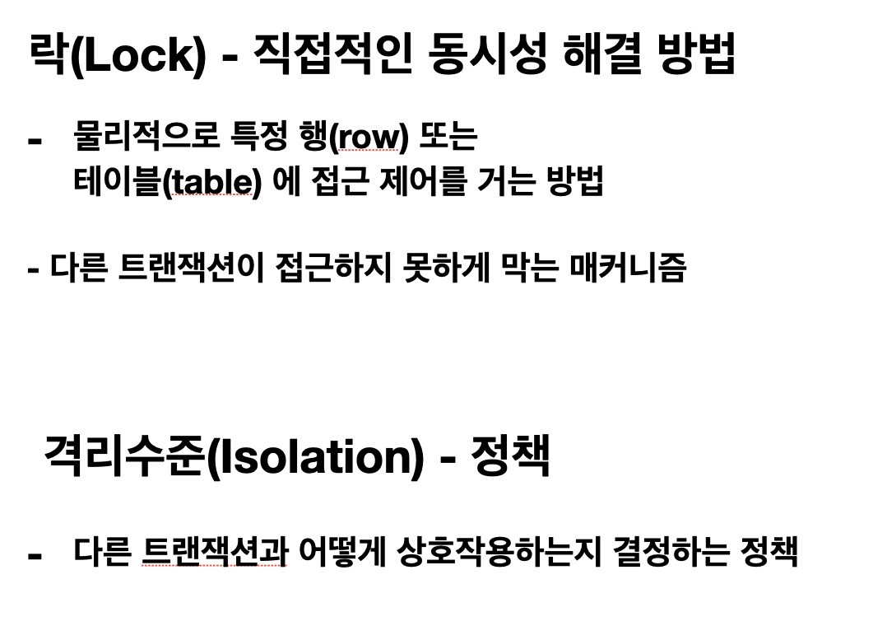
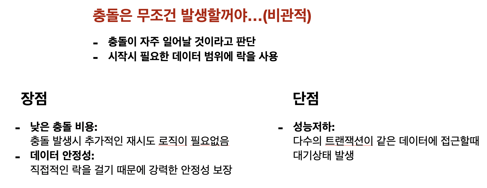
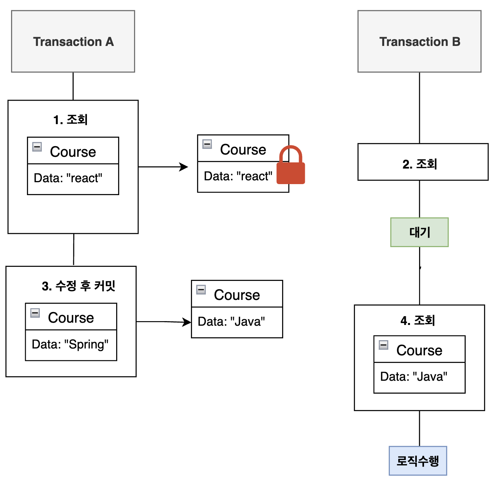
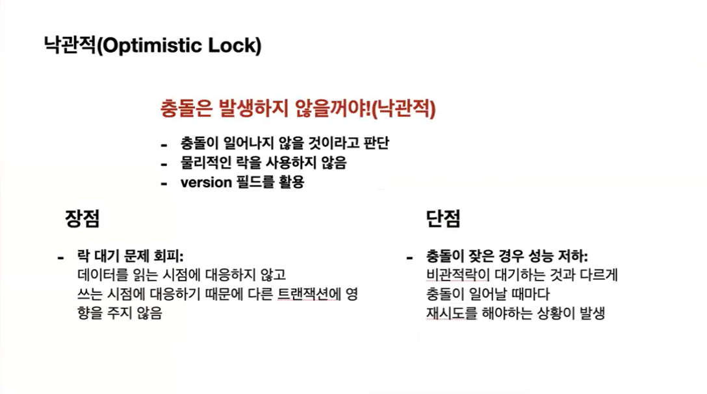
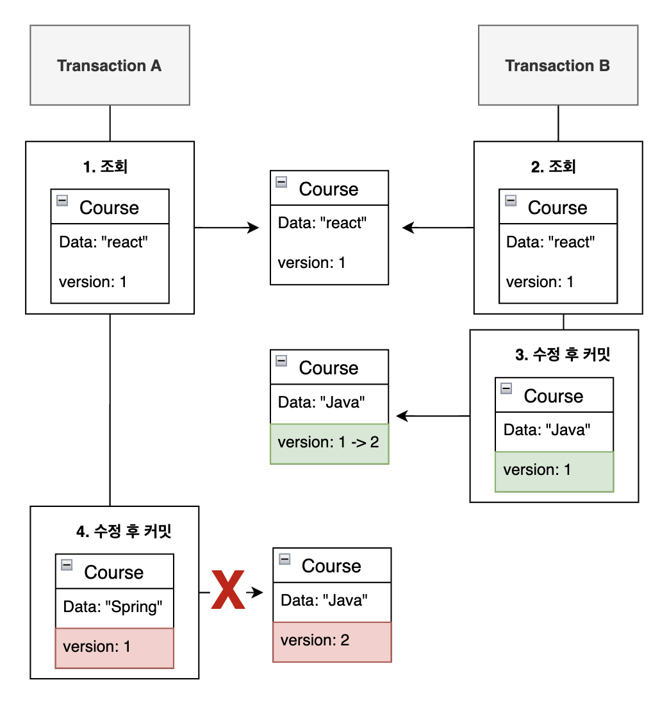
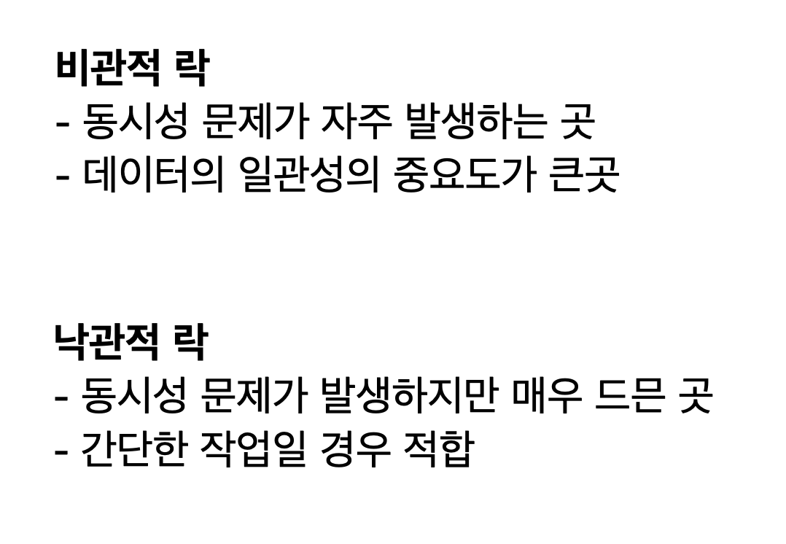

# Lock

## 락(Lock) 개념

#### 동시성 문제를 논할 때 항상 등장하는 개념 중 하나가  락(Lock) 입니다. 락은 데이터베이스의 특정 행(row) 또는 테이블에 직접 접근 제어를 걸어 다른 트랜잭션이 접근하지 못하게 막는 메커니즘 입니다.
격리수준이 다른 트랜잭션과 어떻게 상호작용하는지 결정하는 정책이라면 락은 직접적인 동시성 해결 방법이라고 생각하시면 됩니다.

##  비관적락(Pessimistic Lock)

### 원리

#### 비관적 락은 데이터베이스 락 매커니즘에 의존하는 동시성 제어 방법입니다. select for update 쿼리가 수행되는 것이라고 생각하시면 됩니다. 먼저 자원에 접근한 트랜잭션이 락을 획득하게 되고 다른 트랜잭션은 락을 획득하기 전까지 대기합니다.

##  낙관적락(Optimistic Lock)

### 낙관적락 설명

### 낙관적락 원리

#### 낙관적 락(Optimistic Lock)은 동시성 제어를 위해 데이터베이스 락에 의존하는 대신, 데이터가 수정될 때만 충돌을 감지하는 방식입니다. 이 방법은 보통 충돌이 적거나 드물게 발생한다고 가정하고, 트랜잭션이 끝날 때까지 데이터에 락을 걸지 않고 자유롭게 접근하게 합니다. 하지만 트랜잭션이 커밋될 때 데이터가 수정되었는지 확인하여 충돌을 감지합니다. 충돌이 발생한 경우 트랜잭션을 롤백하고 다시 시도하거나 오류를 처리하는 방식으로 동시성을 제어합니다.

# 락 실습

## 시나리오

## 정리
